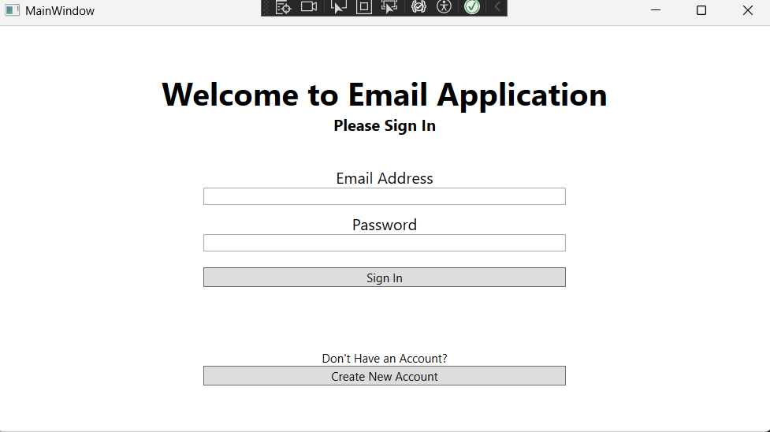
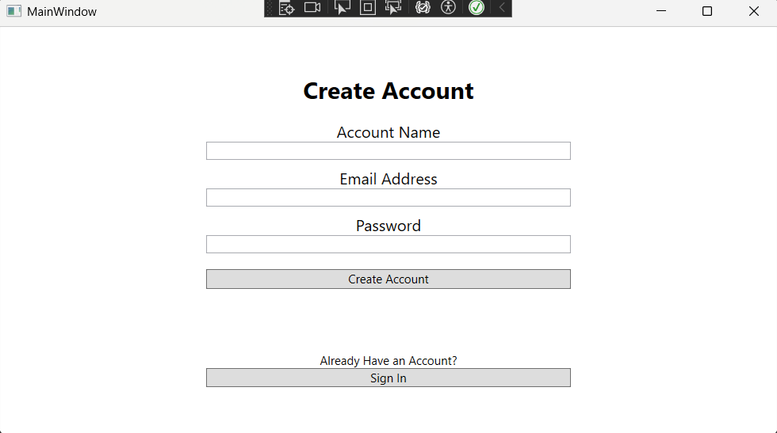
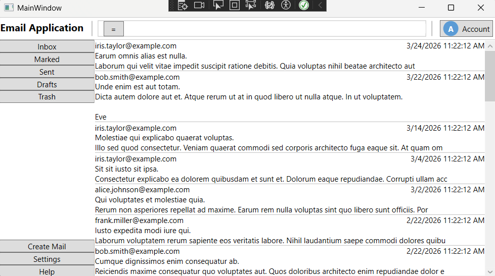
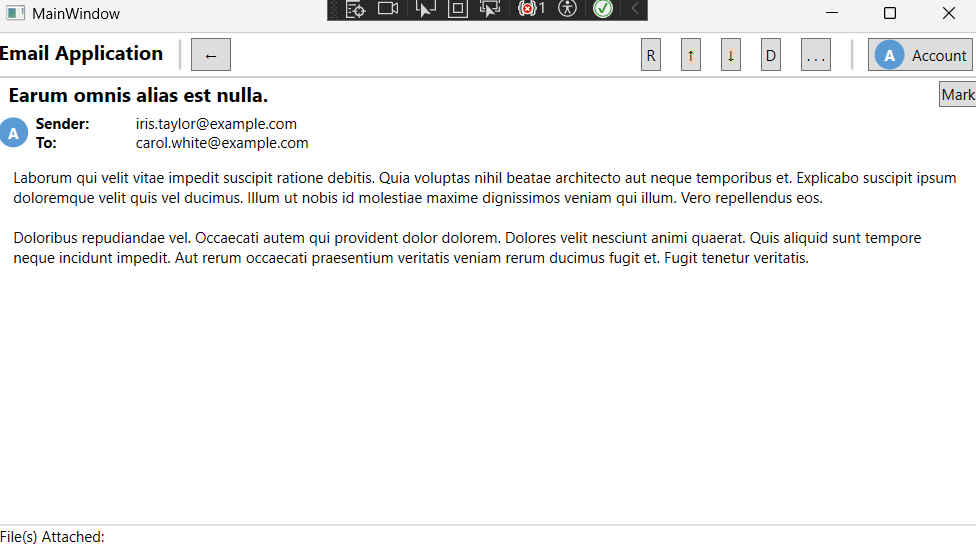
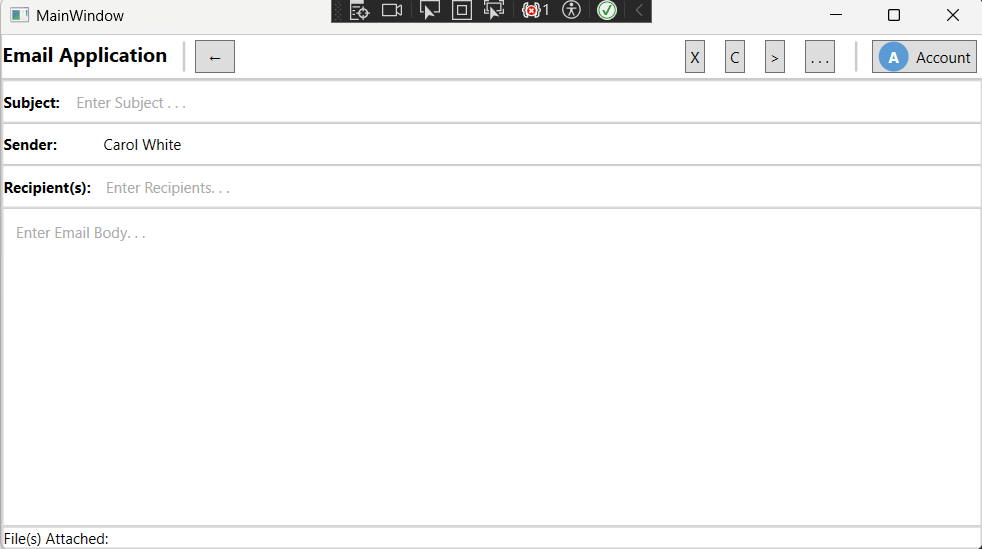

# Desktop Email Application (WPF, C#, T-SQL)
## 1. Overview
A desktop email application built with **WPF (C#)** and **SQL Server**, designed using a **layered client-server architecture** to separate presentation, business logic, and data access across two distinct tiers.

The client implements **MVVM**, along with **mapper** and **API service** layers, to support authentication, email composition, and inbox management. The server exposes HTTP endpoints consumed by the client, backed by **service** and **repository** layers and a **normalized relational database schema** designed to efficiently handle multi-recipient email delivery.

## 2. Features

### Login / Account Creation

- **Login** - Through the login screen, you can sign in to an existing account, which authenticates against the server and returns a JWT used for subsequent requests.

- **Account** - Can create a new account with an associated name, email address, and password, which is securely hashed with BCrypt on the server before storage.

### Inbox

- **Top Navigation Bar** - Serves as the core anchor throughout the application. While not yet implemented, will in the future support advanced user querying

- **Side Bar** - A quick way for users to filter their mail as well as access other important pages such as settings, help or creating new mail.

- **Inbox Panel** - The crux of the inbox page, it displays a dynamically loaded list of emails for the authenticated user including sender, subject, timestamp, and a preview of the body.

### Sending/Receiving Mail
- **Sending Mail** - Contained in its own page, mail can be created by users and sent to other users. This includes subject and body as well.

- **Receiving Mail** - Similarly with its own page, users can view the mail entirely they have been sent after clicking on the respective preview mail in their inbox.

### Multi-Recipient Support

- **One-to-Many** - The databases have been setup to provide support for multiple recipients to receive the same mail sent by a user.

- **Separate Tracking** - Each recipient has their own mail tracked with a status, if it is marked, if it is trashed, and the dates for their actions.

## 3. Screenshots

### Login Screen
*User authentication interface for existing accounts*



### Account Creation
*Form for registering new users with securely hashed credentials*



### Inbox
*Displays received emails with sender, subject and preview*



### Viewing Mail
*Full email content view after selecting a message*



### Creating Mail
*Compose interface supporting multi-recipient email sending*


## 4. Installation & Usage (Docker)

### Prerequisites
- [Docker Desktop](https://www.docker.com/products/docker-desktop/)
- [.NET 10 SDK](https://dotnet.microsoft.com/download) (for the WPF client)

### Setup
1. Clone the repository

2. Run the following from the solution root:
```bash
    docker-compose up --build
```

3. Wait for both containers to show as running. You can verify the server is up at:
- http://localhost:5139/swagger

### Running the Client
Build and launch the WPF client from Visual Studio, or run multiple instances via PowerShell:
```powershell
Start-Process ".\EmailApplication.Client\bin\Debug\net10.0-windows7.0\EmailApplication.Client.exe"
```

### Resetting the Database
To wipe the database and start fresh:
```bash
docker-compose down -v
docker-compose up
```

### Stopping
```bash
docker-compose down
```

## 5. Architecture
The application is split into a client and a server that communicate over HTTP. The client sends requests with a JWT for authentication; the server validates the token before processing.

### Client
*View → View Model → Mapper → API Services*

- **View** – WPF UI components responsible for rendering the user interface.

- **View Model** – MVVM layer managing state and commands, binding the view to underlying data.

- **Mapper** – Translates between server-returned DTOs and view model representations consumed by the UI.

- **API Services** – HTTP client layer responsible for constructing and dispatching requests to the server, including attaching the JWT to request headers.

### Server
*Controller → Services → Repository → Database*

- **Controller** – Exposes HTTP endpoints, handles routing, validates incoming JWTs, and delegates to the service layer.

- **Services** – Contains business logic; mediates between the controller and repository, and organizes data before returning responses.

- **Repository** – Mediates between the service layer and the database, executing queries and mapping results to data models.

- **Database** – SQL Server instance storing all application data.

### DTOs, Data Models, View Models, and View

- **Data Transfer Objects (DTOs)** - An object utilized to help with transferring data between the client and server. This object is what is received between communication between the two before translating it for the next layer.

- **Data Models** - A direct interface with the data representation of an arbitrary record of a specific table. These were kept simple with only simple fields that correspond with the attributes of the table these classes represented.

- **View Models** - A projection of the data models into a user relevant representation. An example is the `EmailViewModel` class which takes from `EmailData` and `AccountData` which comprises of the following:

| Field Name | Data Type | Derived From |
|-|-|-|
| Subject | `string` | `EmailData` |
| Sender | `string` | `EmailData` -> `AccountData` |
| Recipients | `List<string>` | `EmailData` -> `AccountData` |
| Body | `string` | `EmailData` |
| DateCreated | `DateTime` | `EmailData` |
| DateReceived | `DateTime` | `EmailToReceiverData` |
| DateRead | `DateTime` | `EmailToReceiverData` |

- **View** - The user interface representation of data. The examples of this is the display of a collection of email previews in the inbox, or the mail being displayed in the view mail page.

### Services

- The service layer serves as a mediator between the layers of data such as taking requests then calling for the repository to fetch data it needs and then organizes that data. Another example is taking user input, organizing it into a data representation then sending it to the repository to insert into the database.

- The current services are `EmailService` and `AccountService`.

### Repositories

- The repository serves as the mediator between the data model and the actual records in the database.

- The current repositories are the `AccountRepository`, `EmailRepository`, `EmailToReceiverRepository`, and `InboxEmailRepository`.

## 6. Database Design
The database is designed using a normalized relational schema to minimize redundancy and support efficient querying. In addition, the database supports one account sending many emails and one email being received by many accounts.

### Account:
Stores user credentials and account information.

| Attribute Name | Data Type | Constraint |
|-|-|-|
| AccountID | `INT` | `PRIMARY KEY` |
| EmailAddress | `NVARCHAR(255)` | `NOT NULL`, `UNIQUE` |
| AccountName | `NVARCHAR(255)` | `NOT NULL` |
| PasswordHash | `VARCHAR(255)` | `NOT NULL` |
| DateCreated | `DATETIME` | `NOT NULL` |
| DateLastLogin | `DATETIME` | `NOT NULL` |

### Email:
Stores core email data. 

| Attribute Name | Data Type | Constraint |
|-|-|-|
| MailID | `INT` | `PRIMARY KEY` |
| SenderID | `INT` | `FOREIGN KEY` -> `Account(AccountID)` |
| Subject | `NVARCHAR(255)` | `NOT NULL` |
| Body | `VARCHAR(MAX)` | `NOT NULL` |
| DateCreated | `DATETIME` | `NOT NULL` |

### EmailToReceiver:
Junction table mapping emails to recipients, enabling one-to-many relationships and per-recipient metadata tracking.

| Attribute Name | Data Type | Constraint |
|-|-|-|
| MailID | `INT` | `FOREIGN KEY` -> `Email(MailID)` |
| ReceiverID | `INT` | `FOREIGN KEY` -> `Account(AccountID)` |
| MailStatus | `INT` | `NOT NULL` |
| Marked | `BIT` | `NOT NULL` |
| Trashed | `BIT` | `NOT NULL` |
| DateTrashed | `DATETIME` |  |
| DateSent | `DATETIME` | `NOT NULL` |
| DateReceived | `DATETIME` |  |
| DateRead | `DATETIME` |  |

As to note, `MailStatus` is represented as an `INT` but in the application casts to an Enum which has the following:

| Name | Value |
| - | - |
| Failed | -1 |
| Draft | 0 |
| Sending | 1 |
| Sent | 2 |
| Received | 3 |
| Read | 4 |

## 7. Security

### JWT (JSON Web Token)
After the server validates user credentials at login, it issues a signed JWT. The client stores this token and attaches it to the `Authorization` header of every subsequent HTTP request. The server validates the token on each request before allowing access to protected endpoints. This token on the client side is also stored in `Session` and default `Authorization` header.

### BCrypt
User passwords are hashed using BCrypt before storage, ensuring no plaintext credentials are stored.

## 8. Future Work / Optimization Considerations

### JWT Refresh Tokens
Implement refresh token rotation so that short-lived access tokens can be renewed without requiring the user to re-authenticate, improving both security and session continuity.

### Asynchronous Processing
Introduce asynchronous operations on the server side to handle multiple client requests efficiently. This would improve responsiveness and prevent blocking during database or network operations.

### Indexing
Improve database performance by adding indexes on frequently queried columns, particularly foreign keys such as `ReceiverID` and `SenderID`, to optimize inbox and sent mail retrieval.

### Lazy Loading & Caching
- **Lazy Loading** – Load inbox data in batches as the user scrolls, reducing initial load time and bandwidth usage.
  
- **Client-Side Caching** – Cache previously retrieved data and invalidate it based on server-side update timestamps to minimize redundant queries.

### File Attachments
Add support for file attachments by storing files on the server and associating them with emails. The client would retrieve metadata and download files via references.

### Advanced Querying & Filtering
Implement flexible querying capabilities for inbox management, including:
- Filtering by status (e.g., read, marked, trashed, sent).
  
- Search by sender, subject, body, and date ranges.
  
- Support for compound queries (AND, OR, negation).
### Drafts & Trash Management
- **Drafts** – Allow users to save, edit, and send emails at a later time
  
- **Trash System** – Move deleted emails to a temporary storage with automatic cleanup after a defined retention period  

## 9. License
This project is licensed under the MIT License - see the `LICENSE` file for details.
